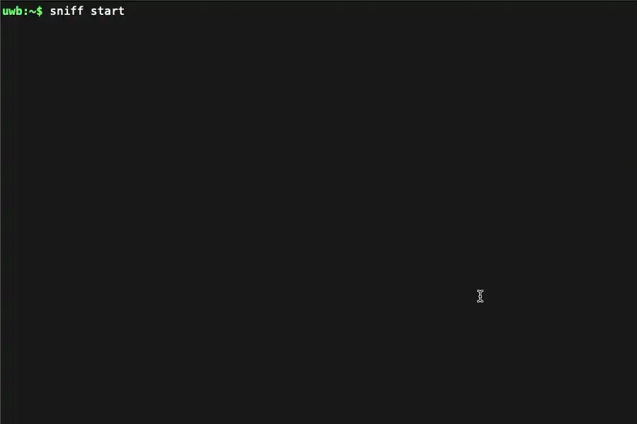
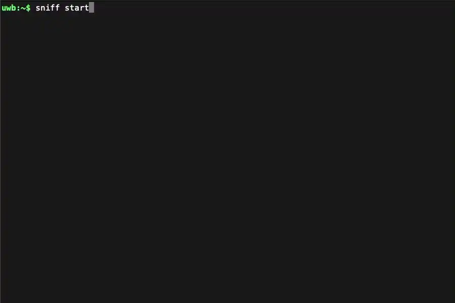
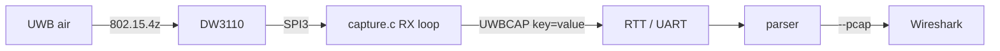

<h1 align="center">Passive HRP-UWB Frame Capture · DWM3001CDK</h1>

<p align="center">
Receive-only 802.15.4z HRP-UWB sniffer for the Qorvo <b>DWM3001CDK</b> (DW3110&nbsp;+&nbsp;nRF52833).<br>
It logs every frame it hears (good frames <i>and</i> STS/FCS/PHY faults) as one greppable <code>UWBCAP</code> line, built straight on Qorvo's <code>dwt_uwb_driver</code> PHY API.
</p>

<p align="center">


</p>

<p align="center">
 <br>
<sub><code>sniff raw_pretty</code> (left) and <code>sniff human</code> (right): two live per-frame views of the capture</sub>
</p>



> [!CAUTION]
> Receive-only research tool: it listens, never transmits, and cannot recover a session's keys. Use it only on traffic you are authorized to monitor; radio, wiretap, and computer-access law compliance is your responsibility.

## Setup

**Requires** [nRF Connect SDK **v3.3.0**](https://developer.nordicsemi.com/nRF_Connect_SDK/doc/latest/nrf/index.html) (Zephyr 4.3.99), the release that ships the in-tree `qorvo/decawave_dwm3001cdk` board, with `west` on your `PATH`.

```bash
git submodule update --init          # populate external/dw3000 (Qorvo DW3000 driver)
```

> [!NOTE]
> The driver is the ISC-glue [`br101/zephyr-dw3000-decadriver`](https://github.com/br101/zephyr-dw3000-decadriver) port at `external/dw3000`; its bundled Qorvo `dwt_uwb_driver` carries Qorvo's own license and is not vendored here.

## Build

Single-core nRF52833, so use **`--no-sysbuild`**; the board overlay auto-applies by name.

```bash
# Already have an NCS v3.3.0 workspace? Build the app freestanding against it:
west build -b decawave_dwm3001cdk/nrf52833 --no-sysbuild -p always .
```

<details>
<summary><b>No NCS yet? Fetch the pinned workspace</b></summary>

The repo ships a [`west.yml`](west.yml) pinned to NCS v3.3.0. Clone into a **dedicated parent dir** (west places NCS as siblings), then:

```bash
west init -l uwb-sniffer     # this repo = the manifest repo
west update                  # fetch pinned NCS (Zephyr, sdk-nrf, HALs)
west build -b decawave_dwm3001cdk/nrf52833 --no-sysbuild -p always uwb-sniffer
```
</details>

## Flash & run

```bash
nrfutil device list                       # note the CDK's J-Link serial
west flash --dev-id <CDK_SERIAL>          # program over the onboard J-Link
```

Open the console on the CDK's VCOM (`/dev/tty.usbmodem*`, **115200 8N1**) or over RTT:

```bash
JLinkRTTLogger -Device NRF52833_XXAA -RTTChannel 0 -if SWD -Speed 4000 capture.log
```

> [!TIP]
> **Bring-up gate:** on boot the firmware reads `DEV_ID` and expects `0xDECA0302` (DW3110). `DEV_ID=0x... OK` on the console confirms the SPI + RESET pinmap is right.

Capture **auto-starts** on boot. On macOS, skip the serial GUI: `./capture.sh rec run.log` records the VCOM and shows a live decoded table while tee-saving the raw log ([`capture.sh`](capture.sh)).

## Drive it · shell (RTT / UART)

```text
sniff | sniff help                              # grouped command reference
sniff start | stop                              # arm / disarm RX
sniff summary | human | raw_pretty | raw        # console output views
sniff chan <5|9>   sniff sp <0..3>   sniff ccc  # retune PHY (ccc = Aliro default)
sniff stskey <32hex>   sniff stsiv <32hex>      # decode a keyed session
sniff scan | burst [N] | minpeak <hex> | stats  # capture tools
```

Defaults are the Aliro/CCC ranging PHY (chan 9, code 9, plen 64, SFD 4a, 6.8 Mbps, **SP0**), the CCC v4 Table 21-1 Config 0000 set, so the cleartext **Pre-POLL** at the head of each ranging round is heard out of the box. The keyed **POLL/RESP/FINAL** are SP3-ND: load the session key/IV and `sniff sp 3`.

## Analyse

```bash
python3 parser/uwb_capture_parse.py capture.log                  # decoded table (rssi/fp dBm)
python3 parser/uwb_capture_parse.py capture.log --analyze        # ranging-round summary
python3 parser/uwb_capture_parse.py capture.log --pcap out.pcap  # 802.15.4 for Wireshark
```

The per-field `UWBCAP` record format, STS-key byte order, and known limits are documented inline in [`src/capture.c`](src/capture.c) and the parser.

## Credits

This firmware is our own work, but it stands on third-party code we build against and call into:

- **Qorvo** for the `dwt_uwb_driver` DW3000 "decadriver" PHY API this app is written directly on top of. It carries Qorvo's own license and is not vendored here.
- **[`br101/zephyr-dw3000-decadriver`](https://github.com/br101/zephyr-dw3000-decadriver)** (GitHub `br101`) for the ISC-licensed Zephyr module glue that packages the Qorvo driver as the out-of-tree module at `external/dw3000`.
- **The [Zephyr Project](https://www.zephyrproject.org/) (Apache-2.0) and Nordic Semiconductor's [nRF Connect SDK](https://developer.nordicsemi.com/nRF_Connect_SDK/doc/latest/nrf/index.html)** for the RTOS, board support, and build system this app targets.

## License

MIT. See [`LICENSE`](LICENSE). Our source files carry a short MIT header; the Qorvo DW3000 driver under `external/dw3000` is not part of this repo and is governed by its own license.
